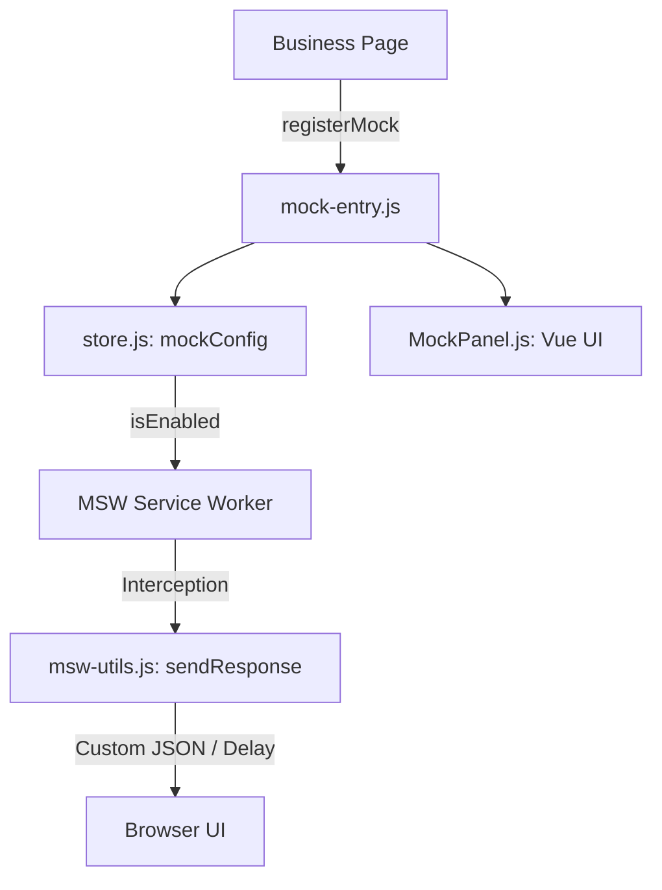

# MSW 攔截系統總覽 (Overview)

本文件旨在提供 AI 與開發者快速掌握 MSW (Mock Service Worker) 整合系統的全貌。

## 🏗️ 系統架構與資料流 (Architecture)

本系統採用 **UI 驅動 Mock** 的模式，讓開發者能透過前端面板即時切換 Mock 行為。



1.  **載入機制**: 由 `msw-loader.js` (或 `mock-entry.js`) 負責初始化。
2.  **狀態管理**: 使用 `Vue.observable` 在 `store.js` 維護一個全域響應式物件 `mockConfig`。
3.  **UI 互動**: `MockPanel.js` 是一個懸浮式的 Vue 組件，提供開關、延遲設定及自定義 JSON 輸入。
4.  **攔截執行**: MSW Worker 根據 `mockConfig` 的狀態決定是否要攔截 API 或透傳 (passthrough)。

## 📂 核心目錄導覽

- **`/src`**: 源碼目錄。
    - `mock-entry.js`: 系統入口，負責 Worker 啟動與 UI 掛載。
    - `store.js`: 核心狀態機，定義了 `isEnabled`, `apiDelay` 等狀態。
    - `msw-utils.js`: 通用輔助工具，標準化 API 回應格式。
    - **`/components`**: 
        - `MockPanel.js`: 懸浮面板 UI 實作（含 Glassmorphism 樣式）。
    - **`/pages`**: 存放各個業務頁面專屬的 Mock Handlers。

- **`/map`**: AI 閱讀專用的分析文檔。
    - `MockPanel.md`: 面板組件詳解。
    - `msw-utils.md`: 工具函式詳解。
    - `pages.md`: 業務頁面串接規範。

## 🛠️ 開發維護規範

### 1. 註冊一個新頁面的 Mock
在業務頁面中引入 `registerMock` 並定義配置：
```javascript
registerMock({
  title: '業務名稱',
  controls: [
    { key: 'myOption', label: '測試選項', type: 'select', options: [...] }
  ],
  handlers: [
    http.get('/api/data', () => { ... })
  ]
});
```

### 2. 標準化回應建議
開發 Handler 時，請務必使用 `sendResponse` 輔助函式，以確保 UI 面板的「延遲」與「自定義 JSON」功能生效：
```javascript
import { sendResponse } from '../msw-utils';
import { mockConfig } from '../store';

// Handler 範例
http.post('/api/save', async () => {
  return await sendResponse({
    data: { success: true },
    mockConfig: mockConfig
  });
});
```

## ⚠️ 關鍵邏輯與注意事項 (Critical Paths)
- **Service Worker 作用域**: 啟動時會動態計算 `appRoot`，需確保 `mockServiceWorker.js` 檔案位於正確的虛擬目錄根路徑下。
- **持久化機制**: 
    - `isEnabled` 儲存於 `localStorage` (跨分頁持久)。
    - `position` 儲存於 `sessionStorage` (分頁獨立)。
- **樣式隔離**: 所有 UI 樣式均透過 JS 動態注入，使用 `.mock-` 前綴以避免干擾業務 CSS。
