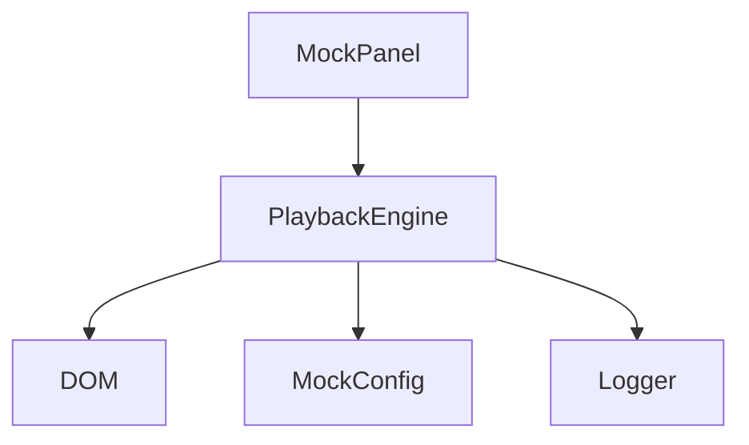
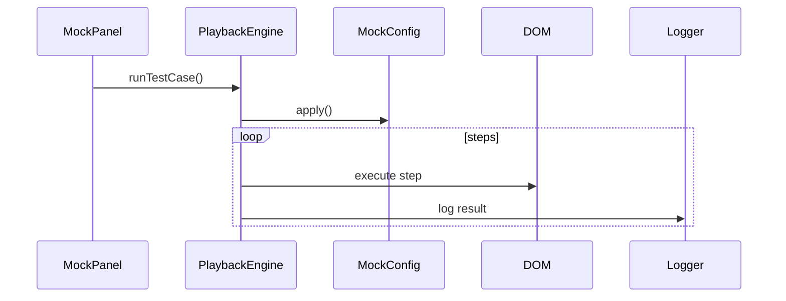

# 🎬 Frontend Playback Engine 規格文件

本文件定義一套「純前端測試播放引擎（Playback Engine）」規格，
可與 MSW Mock 系統整合，讓使用者透過 UI（MockPanel）播放測試流程。

---

# 🧭 一、設計目標

## 🎯 核心目標
- 在瀏覽器中「重播使用者操作流程」
- 不依賴 Playwright / Puppeteer（純前端）
- 可與 MSW mockConfig 整合
- 可被 MockPanel UI 觸發

---

## 🎯 使用場景
- UI Demo 展示
- 手動測試流程重播
- QA 測試輔助
- 錄製流程轉測試案例

---

# 🏗️ 二、系統架構



---

# 📦 三、資料結構定義

## 3.1 TestCase 結構

```ts
interface TestCase {
  id: string;
  name: string;
  description?: string;
  mock?: MockConfig;
  steps: Step[];
}
```

---

## 3.2 Step 結構

```ts
type Step =
  | ClickStep
  | InputStep
  | WaitStep
  | AssertStep
  | SelectStep
  | CustomStep;
```

---

### 🔹 ClickStep

```ts
interface ClickStep {
  type: 'click';
  selector: string;
}
```

---

### 🔹 InputStep

```ts
interface InputStep {
  type: 'input';
  selector: string;
  value: string;
}
```

---

### 🔹 WaitStep

```ts
interface WaitStep {
  type: 'wait';
  duration?: number;
  forSelector?: string;
}
```

---

### 🔹 AssertStep

```ts
interface AssertStep {
  type: 'assert';
  selector: string;
  condition: 'visible' | 'exist' | 'text';
  expected?: string;
}
```

---

### 🔹 SelectStep

```ts
interface SelectStep {
  type: 'select';
  selector: string;
  value: string;
}
```

---

### 🔹 CustomStep（擴充用）

```ts
interface CustomStep {
  type: 'custom';
  action: string;
  payload?: any;
}
```

---

# ⚙️ 四、Playback Engine API

## 4.1 主執行函式

```ts
async function runTestCase(testCase: TestCase): Promise<void>
```

---

## 4.2 單步執行

```ts
async function runStep(step: Step): Promise<void>
```

---

## 4.3 控制 API

```ts
pause()
resume()
stop()
```

---

# 🔄 五、執行流程



---

# 🧠 六、核心邏輯

## 6.1 Selector 查找（強制）

```ts
function getElement(selector: string): HTMLElement
```

規則：
- 使用 `document.querySelector`
- 找不到時 retry（最多 3 秒）

---

## 6.2 Retry 機制

```ts
async function retry(fn, timeout = 3000)
```

---

## 6.3 Delay 控制

```ts
function delay(ms: number)
```

---

# 🧪 七、Step 執行規則

## Click

```ts
element.click()
```

---

## Input

```ts
element.value = value
element.dispatchEvent(new Event('input'))
```

---

## Wait

優先順序：

1. forSelector
2. duration

---

## Assert

條件：

| condition | 行為 |
|----------|------|
| visible  | element.offsetParent !== null |
| exist    | element !== null |
| text     | element.textContent |

---

# 🔗 八、Mock 整合

## 8.1 TestCase mock 定義

```ts
mock: {
  isEnabled: true,
  apiDelay: 1000,
  scenario: 'error'
}
```

---

## 8.2 套用方式

```ts
function applyMockConfig(mock)
```

來源：

- window.mockConfig
- Vue.observable store

---

# 🖥️ 九、MockPanel 整合

## UI 行為

```ts
onClickPlay(testCaseId)
```

---

## 呼叫

```ts
runTestCase(testCase)
```

---

## 顯示狀態

- ⏳ running
- ✅ success
- ❌ fail

---

# 📊 十、Logger 規格

```ts
interface Log {
  step: Step;
  status: 'success' | 'fail';
  message?: string;
}
```

---

# ⚠️ 十一、錯誤處理

- selector 找不到 → retry → fail
- assert 失敗 → 中止流程
- step error → 記錄 + 中止

---

# 🚀 十二、擴充能力

## 未來可支援：

- iframe 操作
- drag & drop
- keyboard events
- scroll
- snapshot 比對

---

# 🧩 十三、範例 TestCase

```json
{
  "id": "login-test",
  "name": "登入流程",
  "mock": {
    "isEnabled": true,
    "scenario": "success"
  },
  "steps": [
    { "type": "input", "selector": "#username", "value": "admin" },
    { "type": "input", "selector": "#password", "value": "1234" },
    { "type": "click", "selector": "#login-btn" },
    { "type": "wait", "forSelector": ".dashboard" },
    { "type": "assert", "selector": ".dashboard", "condition": "visible" }
  ]
}
```

---

# 🏁 十四、完成標準（Definition of Done）

- 可播放 test case
- 支援 click / input / wait / assert
- 可與 MockPanel 整合
- 有錯誤提示與 log
- 支援 retry 機制
