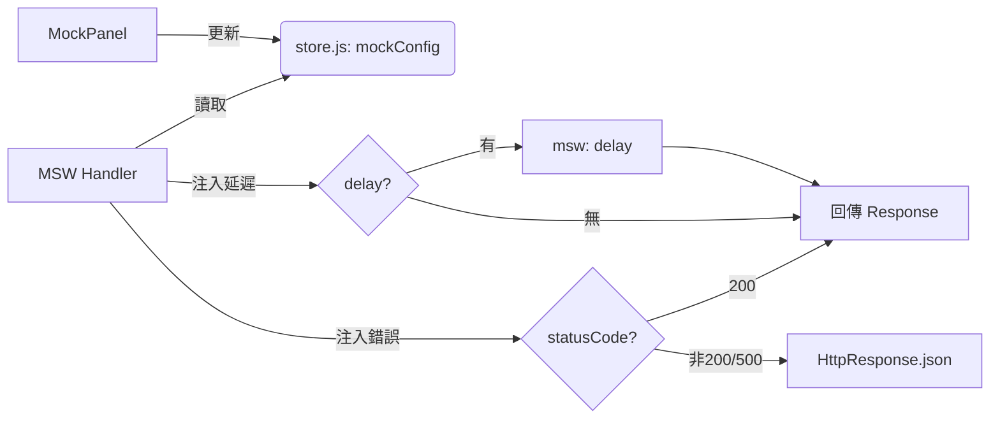

# 互動功能改良計畫書

## 1. 核心目標
建立一個基於 Vue 響應式系統的全域控制面板，使開發者能動態控制與攔截當前 UI 中的 Vue 元件狀態與 API 回應行為，提升開發與除錯效率。

## 2. 交互改善項目

### 2.1 狀態總線 (State Bus) 改進
- 統一 `store.js` 中的 `mockConfig` 作為單一事實來源 (Single Source of Truth)。
- 使用 `Vue.observable` 確保 Mock 面板與業務應用程式之間能進行零延遲的響應式數據同步。

### 2.2 控制項類型擴展 (Dynamic UI Controls)
- **基礎控制項**：
    - `Boolean Switch`：功能模組顯隱、除錯模式切換。
    - `Select Menu`：下拉切換業務場景、API 回傳成功/失敗代碼模擬。
- **進階控制項**：
    - `JSON Editor`：在 Mock 面板直接注入龐大的 Mock 資料格式，並即時反應在 UI 上。
    - `Numeric Slider`：動態調整 API 延遲時間、模擬弱網環境。
    - `Action Button Group`：(新增) 一鍵觸發「資料注入」、「重設狀態」或「頁面導航」等自訂行為。

### 2.3 雙向控制路徑
- **下行連動 (Control Path)**：
    - `MockPanel` -> `mockConfig` -> `UI Components` (由業務組件監聽總線狀態變更來達成動態渲染)。
    - 應用場景：測試多語系、控制對話框開啟、模擬特殊權限權益。
- **上行回饋 (Feedback Path)**：
    - `UI Actions` -> `mockConfig` -> `MockPanel`。
    - 應用場景：將頁面捕捉到的錯誤或特定的 API 回傳參數即時更新到 Mock 面板中供檢視。

### 2.4 主畫面動態連動 (Main Display Dynamic Integration)
- **路由/場景導覽 (Route Navigation)**：規劃 `Route Navigator` 控制項，使開發者能驅動主畫面跳轉至特定路徑 (如：不經過登入流程直接進入後台)。
- **全局命令觸發 (Global Command Hooks)**：實作 `Action Button` 控制項，允許 Mock 面板觸發主程式的全域事件（如：強迫頁面重整、關閉所有視窗、切換佈局深淺色）。
- **佈局動態切換**：整合 `Layout Control`，允許 Mock 面板切換主畫面的嵌入方式（如：浮動、內嵌側欄、全螢幕除錯）。

### 2.5 邊際案例 (Edge Cases) 實作機制詳解
為達成「無開發者視窗測試」，系統實作了以下模擬管道：

#### 實作邏輯架構 (MSW Pipeline)

#### 具體模擬實作與效果 (Case Scenarios)
1. **回應逾時 (TIMEOUT)**:
   - **實作**: 在 `msw-utils.js` 的 `sendResponse` 中串接 `delay(mockConfig.apiDelay)`。
   - **效果**: 觀察前端是否出現 "請求逾時" 的 Toast 提示，或 Loading 骨架屏是否正確處理長掛請求。
2. **授權失效 (401 UNAUTHORIZED)**:
   - **實作**: 在 Mock 面板切換開關一鍵注入 `Expired Token` 回應，由 MSW 攔截並回傳 `status: 401`。
   - **效果**: 模擬 Token 過期後，前端業務代碼是否能觸發全域攔截器 (Interceptor) 並自動導向登入頁。
3. **伺服器崩潰 (500 ERROR)**:
   - **實作**: 在選單中選擇 `Code500`，使 Handler 回傳原生 HTML 字串或非 JSON 格式的消息。
   - **效果**: 測試系統是否能正確導向 `Error 500` 全域錯誤頁，而非發生 UI Crash 保持空白。
4. **巨量/異常資料 (DATA STRESS)**:
   - **實作**: 利用 `JSON Editor` 注入 100 筆測試資料或欄位遺失的 JSON 字串。
   - **效果**: 驗證分頁組件 (Pagination) 的渲染與 UI 佈局在極端資料下的穩定性。

### 2.6 表單/狀態動態注入 (Dynamic Data Injection - 新增)
為支援複雜情境的「一鍵回測」，規劃以下數據注入機制：
- **資料定義模式**：利用 `_tmpData` 在各頁面 Mock 定義檔中建立多組場景資料集。
- **注入鏈路**：
    1. **選取情境**：MockPanel 提供 `Injection List`。點擊某個案例時，將對應的 `_tmpData[key]` 寫入 `mockConfig.activePayload`。
    2. **觸發信號**：同時更新 `mockConfig.lastAction` (例如: `{ type: 'FILL_FORM', timestamp: Date.now() }`)。
    3. **主畫面承接**：Vue 組件透過監聽器偵測到注入請求後，自動將 `activePayload` 映射並賦值給內部 `form` 資料模型。
- **實際效益**：大幅減少測試人員手動輸入長表單的時間，提高對各類表單校驗邏輯 (Validation) 的回歸測試效率。

## 3. 實作路線圖 (Implementation Roadmap)

### 3.1 第一階段：結構強化
- 完善 `mock-entry.js` 的插件化註冊接口 `registerMock`。
- 新增 `updateConfig` API，方便在任何業務代碼中更動 Mock 狀態。

### 3.2 第二階段：組件升級
- 升級 `MockPanel.js` 樣式與交互，支持拖拽排序控制項。
- 完善 `sessionStorage` 儲存邏輯，支持針對特定路徑 (Path) 記憶 UI 的展開狀態與顯示位置。
- **新增**：實作 `Action Button Group` 與 `Dynamic Injection` 基礎連動邏輯。

### 3.3 第三階段：集成驗證
- 驗證跨作用域（Scope）之下的攔截一致性。
- 提供與主專案對接的操作範例文檔。
- **新增**：驗證 Mock 面板對大型 SPA 主畫面的控制穩定性與佈局反應速度。

## 4. 預期效益
- **測試效率提升**：無需進入開發者視窗即可針對不同邊際案例 (Edge Cases) 進行測試。
- **環境隔離**：保持業務代碼純淨，所有 Mock 與 UI 控制邏輯均集中管理且易於一鍵卸載。
